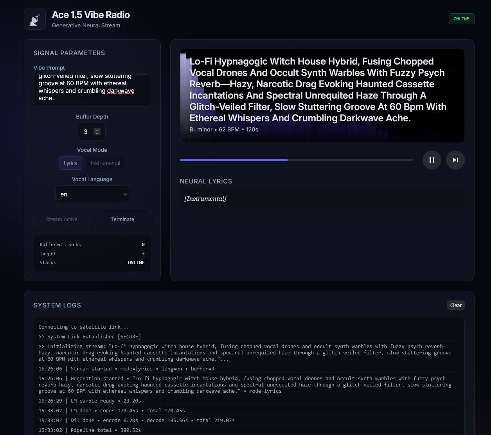

# ACE 1.5 Vibe Radio



A generative music radio station powered by ACE-Step 1.5. This application generates infinite, non-repeating music streams based on text prompts using a locally running DiT (Diffusion Transformer) and 5Hz Language Model.

This repo wraps upstream ACE-Step via git submodule at `vendor/ace-step` so upstream can be updated without forking core inference code.

## Features

- **Text-to-Music**: Generate high-fidelity audio from text descriptions.
- **Infinite Stream**: Continuously queues new tracks to keep the radio playing.
- **ACE-Step 1.5 Integration**: Uses the latest open-weights music generation models.
- **Metadata Generation**: Automatically hallucinates track titles, lyrics, and moods using a 1.7B LM.

## Prerequisites

- **NVIDIA GPU**: Approximately 12GB+ VRAM recommended for the default models.
- **Python**: 3.11+
- **uv**: Project and dependency management.

## Installation

1.  Clone the repository.
2.  Initialize submodules:

    ```bash
    git submodule update --init --recursive
    ```

3.  Install dependencies:

    ```bash
    uv sync
    ```

## Usage

Initialize or update upstream ACE-Step (optional, separate step):

```bash
uv run ace-radio-upstream
```

Start the server:

```bash
uv run ace-radio
```

Optional flags for server command:

```bash
uv run ace-radio --host 0.0.0.0 --port 6109
uv run ace-radio --reload
```

*Note: The first run will automatically download the necessary model weights (approx. 10GB+), which may take some time.*

## Configuration

- **Audio Output**: Generated files are stored in `./tmp` by default. You can change this by setting the `ACE_RADIO_AUDIO_DIR` environment variable.
- **Model Storage**: Models are downloaded to `./checkpoints`.

## Updating Upstream

To update ACE-Step while keeping wrapper code isolated:

```bash
git -C vendor/ace-step fetch
git -C vendor/ace-step checkout <upstream-commit-or-tag>
git add vendor/ace-step
git commit -m "chore: update ace-step submodule"
```

## License

MIT
